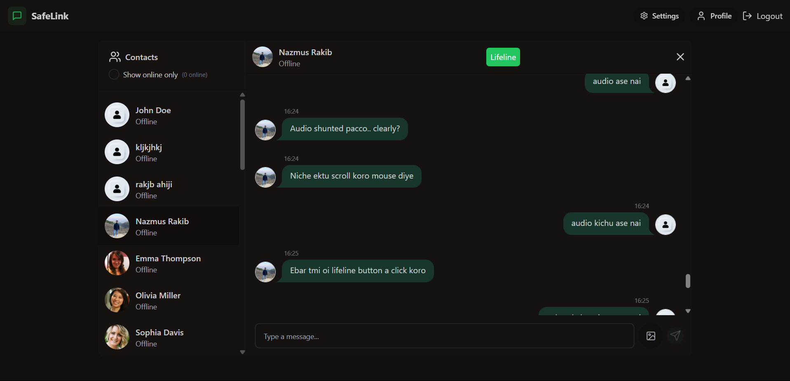
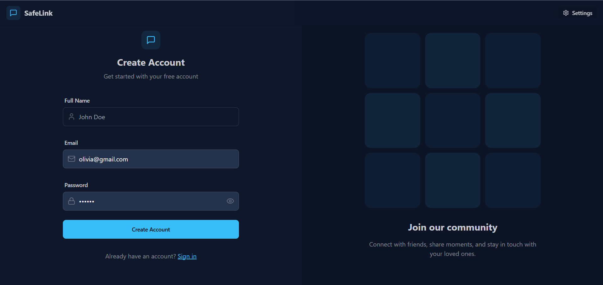
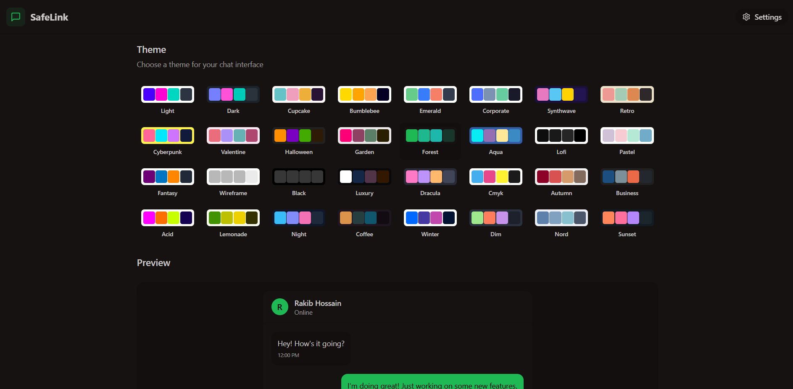
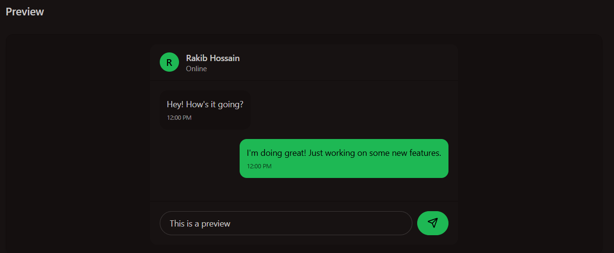

# SafeLink – Emergency Realtime Chat Application

SafeLink is a **full-stack MERN realtime chat application** built to make emergency communication faster, smarter, and more reliable. It combines **instant messaging**, **live location sharing**, and **automatic audio evidence delivery** into a single emergency workflow.

When a user presses the **Emergency Button** inside a chat with a trusted person, SafeLink immediately:

- sends a **danger alert**
- shares a **clickable Google Maps location link**
- includes the user's **latitude and longitude**
- records a **30-second audio clip**
- automatically uploads and delivers that audio **inside the same chat thread**

This creates a seamless safety flow where the user can alert the **exact person they trust** with **one tap**, without needing to switch apps or manually send multiple pieces of information.

## Live Demo

**Deployed Web App:** [https://safelink-a12w.onrender.com](https://safelink-a12w.onrender.com)

---

## Why SafeLink?

In emergency situations, people often do not have the time or clarity to type messages, copy their location, make calls, and explain what is happening. SafeLink is designed to reduce that friction to a single action.

It is built around one simple idea:

> **The faster the alert reaches the right person, the safer the user can be.**

SafeLink transforms a normal chat application into a **real-time personal safety tool**.

---

## Key Features

### Realtime Chat
- One-to-one realtime messaging
- Instant message delivery using **Socket.io**
- Smooth chat experience with live updates

### Emergency Alert System
- Emergency button available directly inside an individual chat window
- Sends an immediate **danger notification** to the selected trusted contact
- Designed for fast action with minimal user effort

### Live Location Sharing
- Captures the user’s current location at the moment of emergency
- Sends:
  - location address
  - latitude and longitude
  - clickable Google Maps link
- Helps the trusted contact open the exact live location instantly

### Automatic Voice Capture
- Starts recording a **30-second audio clip** immediately after the emergency action
- Automatically uploads the recording when finished
- Delivers the audio clip directly into the same chat conversation

### End-to-End Emergency Flow
With a single emergency tap, the app handles the full sequence automatically:
1. alert message
2. location details
3. maps link
4. voice recording
5. delivery to the selected person

This makes SafeLink more than a chat app — it becomes a **practical emergency communication system**.

---

## Tech Stack

### Frontend
- **React.js**
- **Vite**
- **Tailwind CSS**
- **DaisyUI**
- **Zustand**
- **Axios**
- **React Router DOM**
- **Socket.io Client**
- **Lucide React**
- **React Hot Toast**

### Backend
- **Node.js**
- **Express.js**
- **MongoDB**
- **Mongoose**
- **Socket.io**
- **JWT Authentication**
- **bcryptjs**
- **Cloudinary**
- **cookie-parser**
- **CORS**
- **dotenv**

---

## Architecture Overview

SafeLink follows a typical **MERN architecture** enhanced with **Socket.io** for realtime communication.

- **Frontend:** React-based user interface for chat, alerts, and emergency actions
- **Backend:** Express server managing APIs, authentication, chat logic, and emergency workflows
- **Database:** MongoDB for storing users, messages, and related chat data
- **Realtime Layer:** Socket.io for instant communication between users
- **Media Handling:** Cloudinary for media upload/storage support

---

## Emergency Workflow

Here is the core behavior that makes SafeLink unique:

1. User opens a chat with a trusted person
2. User taps the **Emergency Button**
3. SafeLink immediately sends a **danger notification**
4. The app attaches:
   - current location address
   - latitude
   - longitude
   - clickable Google Maps link
5. SafeLink starts recording a **30-second audio clip**
6. Once recording is complete, the clip is automatically uploaded
7. The recording is delivered into the **same chat thread**

This entire process is designed to happen with **minimal friction** during high-stress moments.

---

SafeLink demonstrates strong practical skills in:

- building a **full-stack MERN application**
- implementing **realtime communication** with Socket.io
- designing a **user-centered emergency workflow**
- integrating **location-based functionality**
- handling **media capture and delivery**
- managing **state efficiently** with Zustand
- creating a responsive UI with **Tailwind CSS + DaisyUI**
- structuring frontend and backend as separate scalable services

This project reflects both **technical implementation ability** and **product thinking**, especially around building software for real-world safety use cases.

Installation

1. Clone the repository
git clone <your-repository-url>
cd <your-project-folder>

2. Setup the backend
cd backend
npm install

3. Setup the frontend
cd frontend
npm install

Running the Project Locally
Start backend->
cd backend
npm run dev

Start frontend->
cd frontend
npm run dev

Here is the output:

